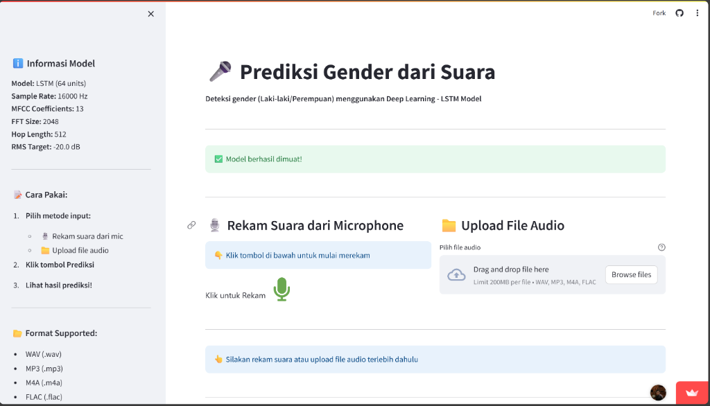

# 🎤 Gender Voice Detection

[](https://share.streamlit.io/)


<br />
<div align="center">
  
</div>

A Deep Learning application to detect gender (Male/Female) from voice recordings using **CNN-LSTM** architecture. This project analyzes audio features (MFCC) to predict gender with high accuracy.

## 🌟 Features

- 🎙️ **Real-time Recording**: Record your voice directly from the browser.
- 📁 **File Upload Support**: Compatible with WAV, MP3, M4A, and FLAC formats.
- 📊 **Advanced Visualization**: View real-time Audio Waveforms and MFCC (Mel-frequency cepstral coefficients) heatmaps.
- 🧠 **Deep Learning Model**: Powered by a custom trained CNN-LSTM model using TensorFlow/Keras.
- 📈 **Confidence Score**: Detailed probability breakdown for predictions.

## 🛠️ Tech Stack

- **Framework**: Streamlit
- **Deep Learning**: TensorFlow, Keras
- **Audio Processing**: Librosa, SoundFile, NoiseReduce
- **Visualization**: Matplotlib
- **Language**: Python 3.11

## 📂 Project Structure

```
├── models/
│   └── lstm_production.h5    # The active trained model
├── notebooks/
│   └── Tubes_DL.ipynb        # Model training and experimentation
├── app.py                    # Main Streamlit application
├── requirements.txt          # Python dependencies
├── packages.txt             # System level dependencies
└── README.md                # Project documentation
```

## 🚀 How to Run Locally

1.  **Clone the repository**
    ```bash
    git clone https://github.com/Start-Ho/Gender-Based-Voice-Detection.git
    cd Gender-Based-Voice-Detection
    ```

2.  **Create a virtual environment (Optional but Recommended)**
    ```bash
    python -m venv venv
    # Windows
    venv\Scripts\activate
    # Mac/Linux
    source venv/bin/activate
    ```

3.  **Install Dependencies**
    ```bash
    pip install -r requirements.txt
    ```

4.  **Run the App**
    ```bash
    streamlit run app.py
    ```

## 🧠 Model Architecture

The core model combines **Convolutional Neural Networks (CNN)** for feature extraction from spectral data and **Long Short-Term Memory (LSTM)** networks for handling temporal sequences in audio data.

- **Input**: 13 MFCC coefficients extracted from audio.
- **Hidden Layers**: CNN layers followed by LSTM units.
- **Optimization**: Adam optimizer with categorical cross-entropy loss.

## 📄 License

This project is licensed under the MIT License - see the [LICENSE](LICENSE) file for details.

---
*Created as a Deep Learning Final Project.*
